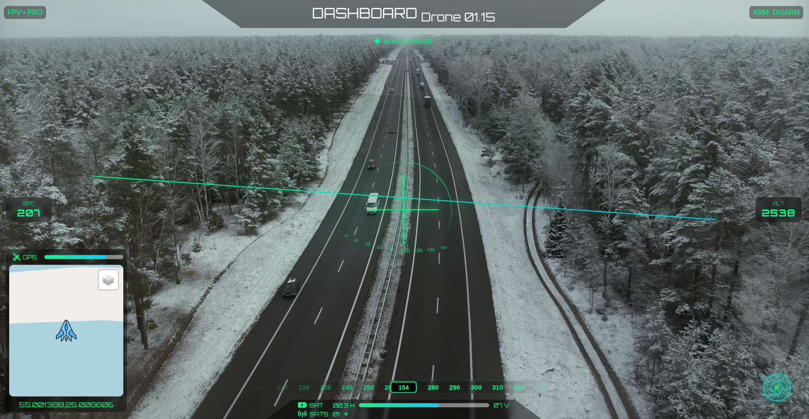

# 🚁 Web Drone Controller (Video, Location, All Data)

A real-time web-based drone control system that allows users to monitor and control drones while receiving live video streaming, GPS location, telemetry data, and other sensor information through a modern web interface.



---

## ✨ Features

- 🎥 Live video streaming from the drone
- 📍 Real-time GPS location tracking
- 📡 Telemetry data monitoring (altitude, speed, battery, etc.)
- 🕹️ Remote drone control via web interface
- 🌐 Browser-based dashboard (no special software required)
- ⚡ Low-latency communication between drone and server
- 🔐 Secure communication (optional authentication support)

---

## 🏗️ System Architecture

The system is typically composed of:

- **Drone Side**
  - Camera module for video streaming
  - GPS module for location tracking
  - Sensors for telemetry data
  - Communication module (WiFi / 4G / RF)

- **Backend Server**
  - Handles incoming drone data
  - Streams video and telemetry to clients
  - Manages control commands from users
  - Built using Python (Flask/FastAPI) or similar

- **Frontend Dashboard**
  - Displays live video feed
  - Shows drone position on a map
  - Visualizes telemetry data
  - Sends control commands to the drone

---

## 🖥️ Tech Stack

- **Frontend:** HTML, CSS, JavaScript (or React/Vue)
- **Backend:** Python (Flask / FastAPI)
- **Streaming:** WebRTC / RTSP / MJPEG
- **Mapping:** Leaflet / Google Maps API
- **Communication:** WebSockets / REST APIs
- **Optional:** MQTT for IoT messaging

---

## 🚀 Getting Started

### 1. Clone the repository
```bash
git clone https://github.com/LaithALhaware/Web-Drone-Controller.git
cd Web-Drone-Controller
```

### 2. Create virtual environment
```bash
python3 -m venv venv
source venv/bin/activate
```
### 3. Install dependencies
```bash
pip install -r requirements.txt
```
### 4. Run the backend server
```bash
python app.py
```
### 5. Open the web interface
```bash
http://localhost:5000
```

---


## 📡 API Endpoints (Example)
- GET /video → Live video stream
- GET /location → Current GPS coordinates
- GET /telemetry → Drone sensor data
- POST /control → Send control commands (move, rotate, etc.)


---

## 🧭 Features Overview
- Live video feed embedded in the dashboard
- Interactive map showing drone position
- Real-time telemetry charts
- Control panel (takeoff, land, directional movement)
- Status indicators (battery, signal strength)


---

## 🔒 Security Considerations
- Use authentication (JWT or session-based)
- Encrypt communication (HTTPS / WSS)
- Restrict access to authorized users
- Validate all incoming control commands


---


## 🛠️ Future Improvements
- AI-based object detection from video feed
- Autonomous navigation modes
- Multi-drone support
- Mobile app integration
- Cloud deployment support

---
## 🤝 Contributing

Contributions are welcome! Feel free to fork the repo and submit a pull request.

---


## 📝 License
This project is licensed under the **License**. See the [LICENSE.txt](LICENSE.txt) ⚖️ file for details.


---
## ❤️ Support This Project
If you find this project useful, consider supporting its development:

💰 Via PayPal: [[PayPal Link](https://www.paypal.com/ncp/payment/KC9EETJDVZQHG)]

Your support helps keep this project alive! 🚀🔥
